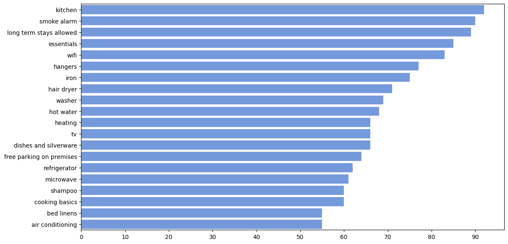
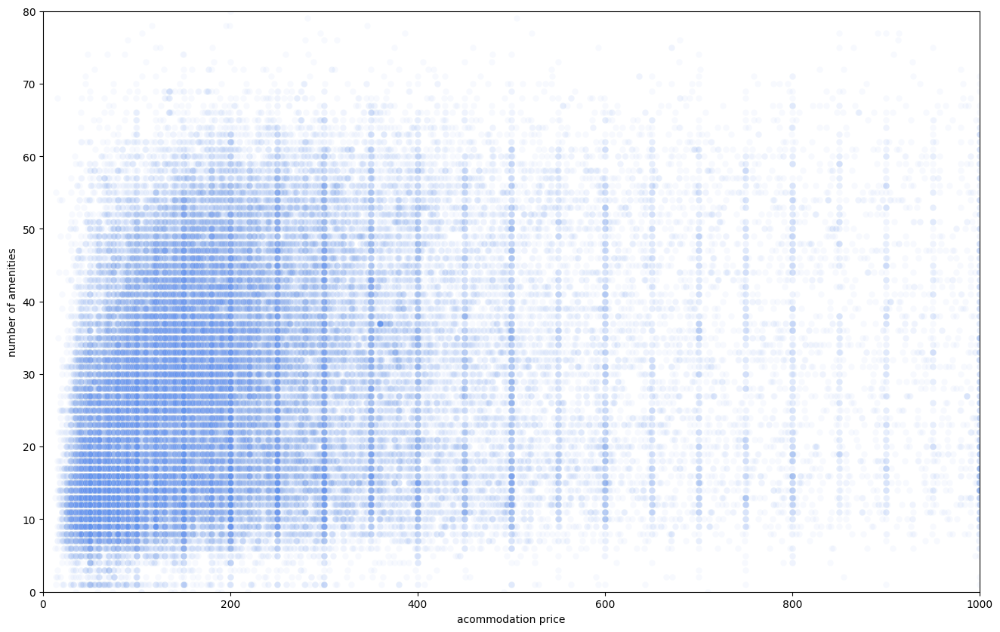
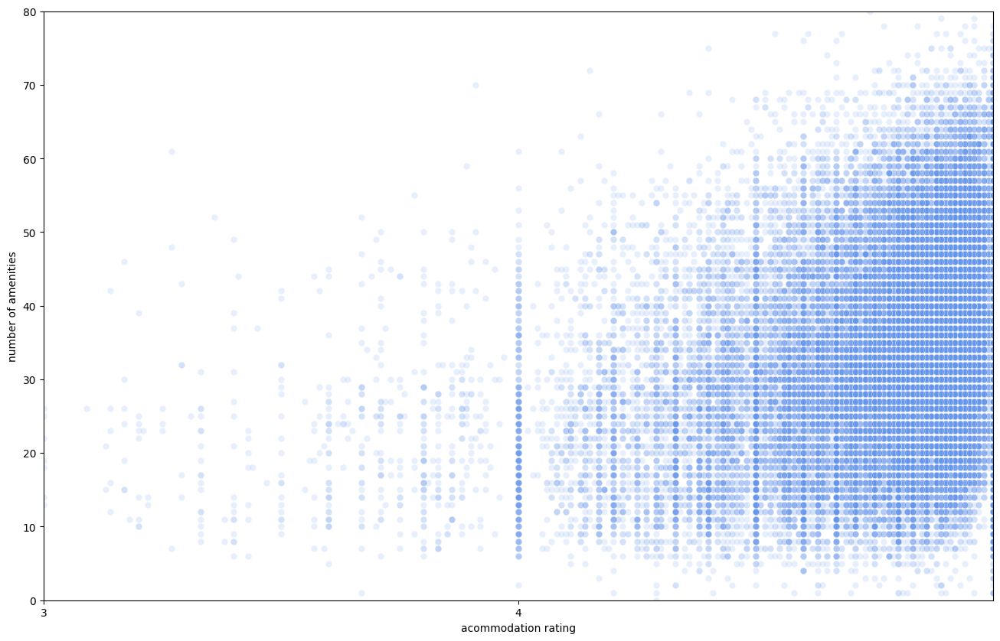

# How to predict ratings of new Airbnb's? 🏠

...or at least try to predict it 😅

During my data science course with Udacity I was challenged to predict something
with public data from Airbnb. Because I'm currently traveling in Australia, I
chose to use all public available data from the land of the kangaroos 🦘 -
thanks at this point to [Inside Airbnb](https://www.insideairbnb.com/)
who provides the data.

Before we dive into the prediction model, let's start with some insights
about the amenities data of the Airbnb accommodations.

## What are the most common amenities in Australia?

You might not have expected this one - it is a kitchen. Roughly 92% of the
accommodations offers a kitchen. Second comes the smoke alarm with around 91% -
hopefully the missing 9% are due to the fact that the owners just forgot to
mention it.

The picture above shows the Top-20 amenities. Which of them do you find
surprising? Or do you miss something?

## Is there a coherence between the number of amenities and prices?

Maybe that sounds logical to you, because the more amenities an accommodation
have, the more valuable it is, so the price should be higher. Well, it's not.

There is just a very slow correlation of 0.141 between them. If you plot all
accommodations as a point in a scatter plot, you can clearly see that there is
no pattern visible.

Ok, but maybe the rating correlates to the number of amenities? Let's have a
look at that...

## Is there a coherence between the number of amenities and ratings?

It is, but it's not very high. Between these we have a correlation of 0.267
which means that there is just a small coherence. Here we can visualize the data
in a scatter plot as well:

In contrast to the price we can see a little trend for the ratings: The more
amenities an accommodation have, the higher the ratings seems to be.
Like the correlation shows, it is admittedly not very high, but there is a
little coherence.

You may also noted that the axis is scaled from 3 to 5. This is because most of
the Airbnb ratings are in that range, so I scaled it down to the relevant
section.

Alright, now we're coming to our initial question.

## Is it possible to predict the rating of an Airbnb accommodation?

Because I'm new to the field I have to admit that there are quite sure better
ways to build such a rating model. I used a linear regression model, which is
a simple but common way to build models in my current understanding.

With my approach I was able to build a model with an r² score of 0.28. If you
are also new to data science, you probably never heard of that score. It's a
statistical measure that is really popular to evaluate the precision of a model.
The interpretation of that score isn't really easy, because you have to take
various dependencies into consideration and apply it to your individual case.

As far as I can assess that score, it seems that the model works not that bad
and can be used for a rough prediction. But as I said before, there are surely
better ways to build a rating model. Moreover we have to consider that there is
plenty of more data (e.g. visits, time-on-site, conversion rate, user rating
behavior etc.) that is not publicly available. So if we would have access
to internal data of Airbnb, it would possibly improve the precision of the model.

If you are interested in the data and code I used, feel free to explore my
repository on GitHub: https://github.com/PatrickChristoph/airbnb_insights_australia/

So what do you think about that? Maybe you are a more experienced data scientist
and have some helpful thoughts on this?
